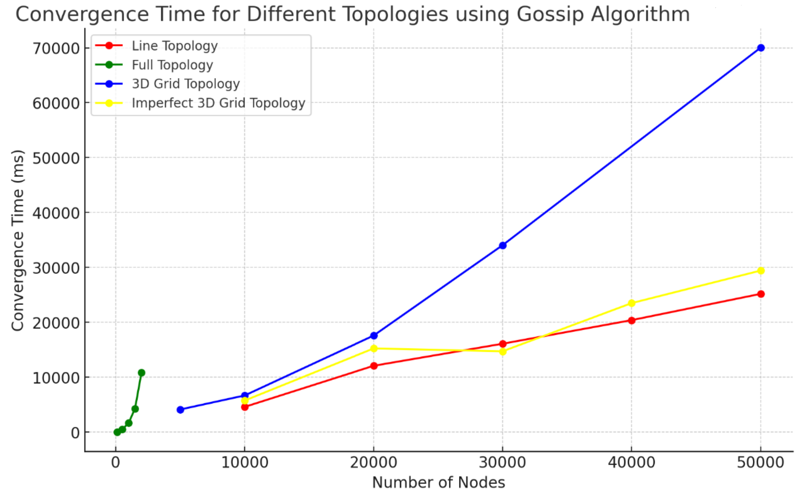
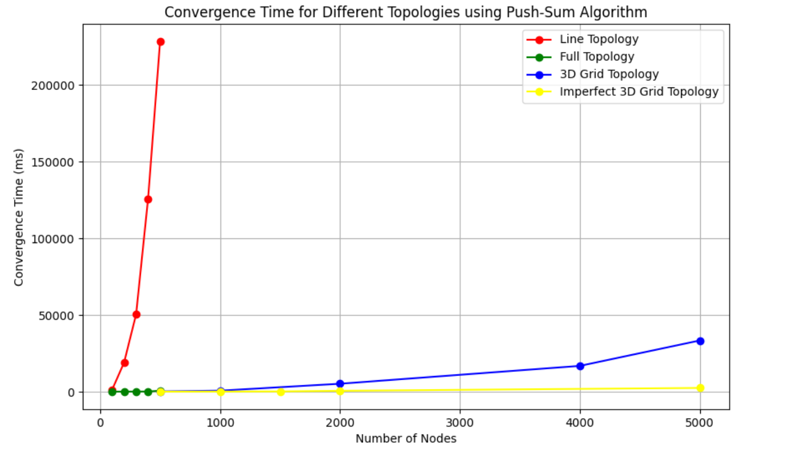

# Problem Statement:
This project aims to utilize two randomized algorithms to achieve distributed consensus - "Gossip" for information dissemination and "PushSum" procotol to calculate the average of all the nodeIds in the network. We look at their convergence over different topologies and analyze their performance.

The Gossip algorithm for information dissemenation:
- Starting: A participant(actor) told/sent a rumor (fact) by the main process
- Step: Each actor selects random neighbors and tells it the rumor.
- Termination: Each actor keeps track of rumors and how many times he has heard the rumor.
It stops transmitting once it has heard the rumor 10 times

Push-Sum algorithm for sum computation:
- State: Each actor Ai maintains two quantities: s and w. Initially, s = xi = i (that is actor number
i has value i) and w = 1
- Starting: Ask one of the actors to start from the main process.
- Receive: Messages sent and received are pairs of the form (s, w). Upon receiving, an actor
should add the received pair to its own corresponding values. Upon receiving, each actor
selects a random neighbor and sends it a message.
- Send: When sending a message to another actor, half of s and w is kept by the sending actor,
and half is placed in the message.
- Sum Estimate: At any given moment of time, the sum estimate is s/w where s and w are the
current values of an actor.
- Termination: If an actor's ratio s/w did not change more than 10−10 in 3 consecutive rounds
the actor terminates. WARNING: the values s and w independently never converge, only the
ratio does.

Topologies:
The actual network topology plays a critical role in the dissemination speed of Gossip protocols. The
topology determines who is considered a neighbour in the above algorithms.
- Full Network: Every actor is a neighbour of all other actors. That is, every actor can talk
directly to any other actor.
- 3D Grid: Actors form a 2D grid. The actors can only talk to the grid neighbors
- Line: Actors are arranged in a line. Each actor has only 2 neighbors (one left and one right,
unless you are the first or last actor).
- Imperfect 3D Grid: Grid arrangement but one random other neighbour is selected from the
list of all actors (6+1 neighbours).

## How to run the code

The run-time arguments are num_nodes, topology[3D,full,line,imp3D], algorithm[gossip,push_sum]

```
cd randomized-algorithms-for-distributed-consensus
ponyc
./randomized-algorithms-for-distributed-consensus 27 3D gossip
```

# Results:





### 1. Convergence Speed Differences:
- Full Topology converges much faster than the other topologies in both algorithms. For
instance, in the Gossip algorithm, even with 2,000 nodes, it converges in 10,841 ms, whereas
other topologies (like Line or 3D) require significantly more time for the same number of
nodes.
- In Push-SUM, the Full topology shows even faster convergence, with times as low as 9 ms for
100 nodes and 694 ms for 500 nodes. This is much quicker compared to other topologies in
Push-Sum.
### 2. Line Topology Performance:
- Gossip (Line) topology scales poorly with increasing nodes. The convergence time for 50,000
nodes is 25,190 ms, showing a steady rise as nodes increase. This pattern is even more
pronounced in push sum (e.g., 228,448 ms for 500 nodes).
- This shows that the Line topology is not efficient for either algorithm, with Push-SUM being
significantly slower than Gossip in this case.
### 3. 3D and Imperfect 3D Topologies:
- In both algorithms, 3D Grid and Imperfect 3D Grid topologies show similar trends but with a
noticeable difference in convergence time.
- In Gossip, the Imperfect 3D Grid converges faster than the 3D Grid for larger node sizes (e.g.,
for 50,000 nodes: 29,432 ms in Imp3D vs. 70,029 ms in 3D).
- For Push-SUM, the 3D Grid and Imperfect 3D Grid topologies both show much better
performance compared to Line topology but are slower than Full topology.
### 4. Push-SUM vs. Gossip Algorithm Performance:
- Push-SUM generally takes longer to converge than Gossip across all topologies. For example,
in the Line topology, the Push-SUM convergence time is much higher (e.g., 228,448 ms for
500 nodes in Push-SUM compared to 25,190 ms in Gossip for 50,000 nodes).
### 5. Scalability:
- In both algorithms, Full Topology maintains its efficiency as the number of nodes increases,
whereas Line Topology deteriorates significantly with larger node counts.

### Conclusion:
- Full topology is the best performer in both algorithms, offering fast convergence even as
nodes increase.
- Line topology shows significant degradation in performance, especially in Push-SUM, making
it the least favourable for scalability.
- 3D and Imperfect 3D topologies are middle-ground performers, with Imperfect 3D slightly
outperforming 3D Grid in large node configurations.
- Gossip generally performs better than Push-SUM in terms of convergence time, especially
for larger node counts in more linear topologies.
